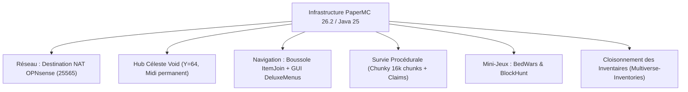

# JoyStick FM — Rapport d'Amélioration du Serveur Minecraft
**Date :** 5 octobre 2026  
**Auteurs :** Équipe Projet AP 1 (BTS SIO SISR) — JoyStick FM  
**Cible d'infrastructure :** Machine virtuelle `srv-minecraft` (`10.30.0.22`), conteneur Docker `minecraft_ap1` (PaperMC 26.2, Java 25 LTS)

---

## 1. Contexte & Objectifs

Dans le cadre du projet d'infrastructure **JoyStick FM** (AP 1 SISR), le serveur Minecraft constitue l'une des vitrines applicatives majeures hébergées au sein de la DMZ Interne. Initialement conçu comme un serveur Vanilla rudimentaire confronté à de lourdes limites techniques (génération anarchique, saccades, permissions inexistantes, absence de menu de navigation), un chantier complet de modernisation et de sécurisation a été mené.

Le présent rapport dresse le bilan exhaustif des améliorations techniques déployées à ce jour, analyse de manière critique les **problèmes et manques remontés lors des tests en jeu**, et expose la feuille de route pour finaliser l'expérience utilisateur.

---

## 2. Bilan des Améliorations Réalisées (Acquis Techniques)

### 2.1. Moteur, Performance & Sécurité
- **Migration sous PaperMC 26.2 (build 129)** : Abandon du serveur vanilla au profit d'un moteur asynchrone hautement optimisé, compilé sous **Java 25 LTS (Temurin)** avec 3 Go de mémoire RAM allouée.
- **Redirection de port OPNsense (Destination NAT)** : Création d'une règle de transfert de port WAN (`192.168.101.37:25565` vers DMZ Int `10.30.0.22:25565`) avec règle de filtrage automatique, garantissant l'accès des élèves du lycée sans exposition du port d'administration RCON (25575).
- **Gouvernance des accès (LuckPerms)** : Suppression du wildcard destructeur `'*'` pour les administrateurs, mise en place de permissions granulaires par monde (`luckperms.*`, `multiverse.*`, `deluxemenus.*`, `essentials.*`).
- **Sauvegardes à froid automatisées** : Intégration dans le script d'orchestration `deploy_gamemodes.sh` d'une archive `tar` immuable stockée dans `/opt/minecraft/gamemodes-backups/` avant toute écriture en production.

### 2.2. Hub Principal dans le Vide
- **Génération d'un Hub Void à Y=64** : Remplacement de l'ancien monde plat par une plateforme céleste personnalisée de 13 448 blocs, éliminant tout décalage d'horizon avec le sol plat.
- **Verrouillage environnemental** : Cycle jour/nuit et météo figés (`minecraft:advance_time false` à 6 000 ticks pour un midi éternel, `minecraft:advance_weather false` sur soleil).
- **Mode Aventure Forcé** : Règle `force-gamemode=true` empêchant toute altération, casse ou placement de blocs par les joueurs au hub.

### 2.3. Ergonomie & Navigation Joueur
- **Boussole interactive (`ItemJoin`)** : Attribution automatique au slot 4 de la barre d'action de l'objet `✦ MENU DES JEUX ✦`, incassable et inamovible, restreint au monde `hub`.
- **Menu graphique (`DeluxeMenus`)** : Interface coffre 27 slots accessible par clic droit ou `/menu`, avec routage direct vers chaque mode de jeu.
- **Scoreboard néon (`TAB`)** : Affichage permanent des métriques du joueur (Pseudo, Rang LuckPerms, Ping, Joueurs connectés, Monde actif, Branding JoyStick FM).

### 2.4. Survie Naturelle Pré-générée & Claims
- **Monde `survie` procédural** : Création d'un monde naturel avec seed `6962026`, difficulté `NORMAL` et PvP actif.
- **Pré-génération totale Chunky** : Génération de **16 129 chunks** (rayon de 1 000 blocs) en 3 minutes et 57 secondes, éliminant totalement les lags d'exploration.
- **Protection des parcelles (`GriefPrevention`)** : Claims actifs à la pelle en or, sécurisation automatique du premier coffre posé par un joueur et protection anti-vol (`PreventTheft=true`).
- **Téléportation aléatoire `/rtp`** : Règle vanilla `/spreadplayers` sécurisée, permettant aux explorateurs de se disperser dans la nature en toute sécurité.

### 2.5. Cloisonnement Étanche des Inventaires
- Configuration de 6 groupes distincts dans `Multiverse-Inventories` (`hub`, `survie`, `bedwars`, `blockhunt`, `legacy_world`, `legacy_minijeux`).
- Neutralisation de la purge aveugle d'ItemJoin (`Clear-Items: Join: false, World-Switch: false`), garantissant que les équipements acquis en Survie ne sont jamais effacés lors d'un retour au Hub.

---

## 3. Analyse Critique des Problèmes Actuels & Retours Utilisateur

Malgré les avancées techniques majeures, les tests en conditions réelles révèlent trois faiblesses d'ergonomie et de contenu qui nuisent à l'expérience de jeu :

### ❌ Problème 1 : Absence de bordures invisibles efficaces au Spawn
* **Constat terrain :** Les joueurs apparaissant sur la plateforme du hub peuvent s'approcher du bord et tomber dans le vide sidéral s'ils s'éloignent du centre, entraînant une chute infinie ou une mort punitive au lobby.
* **Cause technique :** Si une rangée de blocs de barrière a été posée au périmètre extérieur de la grande plateforme, la zone immédiate autour du point d'apparition exact n'est pas ceinturée par une bordure haute (cage transparente). De plus, aucun système de détection de chute dans le vide (`void-fallback`) n'est actuellement configuré pour rattraper automatiquement un joueur en chute libre sous `Y=50` et le ramener instantanément à son point de spawn.
* **Impact :** Mauvaise première impression pour les nouveaux arrivants et frustration en cas de mauvaise manipulation.

---

### ❌ Problème 2 : Absence de plateforme dédiée pour le Lobby des Mini-Jeux
* **Constat terrain :** Lorsqu'un joueur souhaite s'adonner aux mini-jeux, il est actuellement téléporté soit dans une file d'attente suspendue dans le vide (`Y=100` au-dessus de l'arène BedWars/BlockHunt), soit vers l'ancien monde `minijeux` qui était un monde plat non scénarisé. Il n'existe pas de "Lobby des Mini-Jeux" convivial où les joueurs peuvent se regrouper avant de lancer un match.
* **Cause technique :** L'architecture actuelle passe directement du Hub général à l'arène de jeu via la commande `/bw join` ou `/bh join`. Il manque un nœud intermédiaire : un **monde lobby dédié aux mini-jeux** (`lobby_minijeux`), équipé d'hologrammes d'explication, de classements et de PNJ interactifs cliquables.
* **Impact :** Manque d'immersion, sentiment d'isolement avant le début des parties et absence d'un espace d'observation pour les spectateurs non engagés dans un match.

---

### ❌ Problème 3 : Modes de jeux rapides très demandés manquants (Hikabrain, Rush, etc.)
* **Constat terrain :** Le serveur propose actuellement du BedWars standard (4 équipes de 2) et du Cache-Cache (BlockHunt). Cependant, la cible lycéenne et étudiante privilégie très largement les modes de jeu PvP compétitifs, rapides et nerveux en 1v1 ou 2v2 :
  - **Rush** : Version accélérée du BedWars avec ponts en grès, bâton knockback, pioches efficacité et lits rapprochés (matchs de 3 à 7 minutes).
  - **Hikabrain** : Duel 1v1 intense sur une passerelle suspendue étroite (1 bloc de large), où chaque joueur dispose d'un bâton de recul, de blocs de grès et d'une épée pour marquer des points dans le portail adverse (matchs de 2 à 5 minutes).
* **Cause technique :** Les plugins actuels (`ScreamingBedWars 0.2.44` et `BlockHunt 0.2.1`) ont été paramétrés pour des formats d'équipes de taille moyenne. Aucun profil d'arène Rush spécifique ni plugin de duel Hikabrain n'a encore été injecté dans la configuration de production.
* **Impact :** Faible rejouabilité pour deux joueurs seuls voulant s'affronter rapidement en duel pendant les pauses.

---

## 4. Plan d'Action Correctif & Feuille de Route

Pour répondre point par point à ces constats, les actions correctives suivantes sont définies :

| Problème identifié | Action technique corrective | Composants / Commandes impliqués | Priorité |
| :--- | :--- | :--- | :--- |
| **Bordures invisibles Spawn** | 1. Pose d'un garde-corps invisible de 3 blocs de haut (`barrier`) autour du spawn immédiat. 2. Configuration d'un rattrapage automatique anti-vide : téléportation au spawn dès `Y < 50`. | Script procedural `fill` barriers + Déclencheur / gamerule Multiverse ou commande d'écoute. | **P1 (Immédiate)** |
| **Lobby des Mini-Jeux** | Création d'un monde Void thématique `lobby_minijeux` (`VoidGen`) avec une plateforme néon stylisée JoyStick FM, reliant les portails/PNJ vers BedWars, Rush, Hikabrain et BlockHunt. | `mv create lobby_minijeux normal -g VoidGen` Génération procédurale de la structure Bouton dans `games.yml`. | **P2 (Court terme)** |
| **Ajout du Mode Rush** | Configuration d'une arène compacte Rush 1v1 et 2v2 (`rush_1v1`) dans ScreamingBedWars avec boutiques de grès, générateurs accélérés et lits à 30 blocs. | Template d'arène YAML BedWars (`plugins/BedWars/arenas/rush_jfm.yml`) + Arène symétrique générée. | **P2 (Court terme)** |
| **Ajout du Mode Hikabrain** | Installation et configuration d'un module de duel Hikabrain ou d'une passerelle 1v1 avec détection de passage de ligne et attribution de kit instantané (KB stick, blocks, gapple). | Module Bukkit léger dédié ou arène automatisée par commande. | **P3 (Moyen terme)** |

---

## 5. Conclusion & Prochaines Étapes

L'infrastructure du serveur Minecraft `srv-minecraft` a franchi une étape décisive : les fondations système (Docker, Paper 26.2, NAT OPNsense, mémoire, RBAC, isolation d'inventaires) sont robustes, documentées et totalement reproductibles par scripts.

La résolution des trois points soulevés (sécurisation anti-vide du spawn, édification d'un lobby mini-jeux fédérateur et enrichissement du catalogue PvP avec le Rush et l'Hikabrain) permettra de transformer cette base technique solide en un service de divertissement complet et plébiscité par les utilisateurs du réseau de l'établissement.
