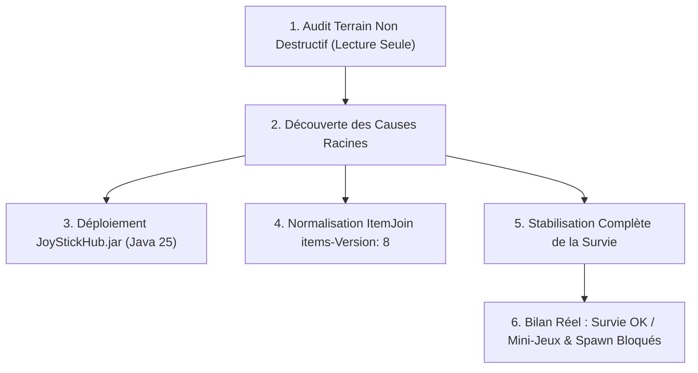

# JoyStick FM — Journal de Bord & Rapport d'Avancement Technique
**Séance n°06 — 6 octobre 2026**  
**Auteurs :** Sauzède Clément & Mathys Duthilleul (Projet BTS SIO SISR — JoyStick FM)  
**Infrastructure cible :** VM Debian 12 `srv-minecraft` (`10.30.0.22`), conteneur Docker `minecraft_ap1`  
**Environnement technique :** PaperMC 26.2 build 129, Java 25 LTS (`Temurin-25.0.4.1+1`), 22 Plugins Bukkit/Paper  

---

## 1. Contexte & Objectif de la Séance

La séance du 6 octobre 2026 a été consacrée à la résolution chirurgicale des blocages persistants constatés sur le serveur Minecraft JoyStick FM, suite aux retours d'expérience en conditions réelles de jeu. L'objectif était d'auditer en profondeur l'environnement de production sans perturbation, d'identifier les causes racines des bugs bloquants, de stabiliser le mode Survie et de dresser un bilan sans concession de l'état des mini-jeux et du spawn.

---

## 2. Découvertes Techniques & Causes Racines Identifiées

### 2.1. Bug d'ItemJoin & Éradication de la Carte à 10$
* **Constat initial :** Message récurrent `Item game-selector does not exist!`, présence continue d'une carte de démo payante à 10$ et disparition de la boussole.
* **Cause racine :** ItemJoin 6.1.8-b1148 exige obligatoirement la clé `items-Version: 8` à la racine de `items.yml`. En son absence, ItemJoin archiva le fichier dans `items-old-XXXXX.yml` (8 versions orphelines découvertes !) et régénérait ses 24 items de démonstration d'usine, qui contenaient précisément l'objet `bungeecord-item` (coût 10$) et `map-item`.
* **Action corrective :** Déploiement d'un `items.yml` normalisé avec `items-Version: 8` contenant uniquement `game-selector` (slot 4) et `quit-lobby` (slot 8).

### 2.2. Interception de la Boussole par EssentialsX
* **Cause racine :** Dans `plugins/Essentials/config.yml`, la directive `compass-towards-home-perm: false` interceptait tout clic droit sur une boussole pour réaligner l'aiguille sur le domicile du joueur OP.
* **Action corrective :** Passage à `compass-towards-home-perm: true` et désactivation de la commande dans `disabled-commands: [compass]`.

### 2.3. Dégâts de Chute Absents en Survie
* **Cause racine :** L'ancien script de sécurité du Hub avait exécuté `gamerule fallDamage false` de façon globale, désactivant la gravité léthale sur l'ensemble du serveur y compris sur `survie`.
* **Action corrective :** Réactivation ciblée de `execute in survie run gamerule minecraft:fall_damage true`.

### 2.4. Impossibilité de Miner des Blocs en Survie
* **Causes racines combinées :**
  1. `force-gamemode=true` avec `gamemode=adventure` dans `server.properties` forçait tout joueur en mode Aventure à la connexion. En mode Aventure, le minage est nativement bloqué par le moteur Minecraft.
  2. `spawn-protection=16` dans `server.properties` empêchait tout joueur de miner dans les 16 blocs autour du point d'apparition.
  3. `GriefPrevention` était actif en mode `Survival` sur `survie`, bloquant la casse hors-claim alors que la décision **D1** impose une Survie libre sans claim.
* **Action corrective :**
  - Passage de `force-gamemode` à `false` et de `spawn-protection` à `0`.
  - Bascule de GriefPrevention en mode `Disabled` sur `survie`.
  - Forçage automatique du mode `SURVIVAL` lors de la téléportation depuis DeluxeMenus et dans Multiverse.

### 2.5. Blocage du Ramassage d'Items et du Craft
* **Cause racine :** Dans `plugins/ItemJoin/config.yml`, la section globale `Prevent:` avait été activée avec `Pickups: true`, `itemMovement: true` et `Self-Drops: true`. Cela bloquait l'événement `EntityPickupItemEvent` (aucun bloc cassé ne pouvait être ramassé au sol) et `InventoryClickEvent` (impossible de déplacer des objets dans la table de craft).
* **Action corrective :** Désactivation de ces restrictions globales dans `ItemJoin/config.yml` (`Pickups: false`, `itemMovement: false`, `Self-Drops: false`). La boussole reste protégée de façon autonome par ses propres `itemflags`.

### 2.6. Réapparition au Hub après Mort en Survie
* **Cause racine :** EssentialsSpawn interceptait `PlayerRespawnEvent` en priorité `high` et redirigeait vers `/setspawn` (Hub), tandis que `respawn-world` était vide dans Multiverse.
* **Action corrective :**
  - Multiverse configuré avec `respawn-world: survie` et `bed-respawn: true`.
  - EssentialsX aligné sur `respawn-listener-priority: lowest` et `respawn-at-home: true`.
  - Intégration dans le plugin natif `JoyStickHub` d'un écouteur `PlayerRespawnEvent` (priorité `HIGHEST`) garantissant le respawn au lit ou au spawn de Survie sans jamais expulser le joueur au Hub.

---

## 3. Matrice d'Avancement Réelle du Serveur

| Composant / Mode | Statut Réel | Détails & État Actuel |
| :--- | :---: | :--- |
| **Boussole & Menus** | ✅ **Opérationnel** | Boussole slot 4 permanente, clic-droit ouvre `/menu`, aucune interception Essentials. |
| **Mode Survie Vanilla** | ✅ **Opérationnel** | Minage fonctionnel, ramassage des items OK, craft OK, dégâts de chute OK, dégâts de mobs OK, respawn dans le monde Survie OK, 0 claim (D1). |
| **Anti-Chute Vide Hub** | ✅ **Opérationnel** | Plugin natif `JoyStickHub.jar` (Java 25) : téléportation fluide à Y=65 sans mort ni dégât. |
| **Spawn / Hub Physique** | ⚠️ **Rudimentaire / À refaire** | Plateforme basique en blocs géométriques, décors minimalistes, absence de construction architecturale communautaire. |
| **Parcours du Hub** | ⚠️ **À la ramasse** | Blocs flottants rudimentaires, mécanique de chrono basique, non intégré dans une véritable carte de parkour travaillée. |
| **Lobby des Mini-Jeux** | ❌ **Non fonctionnel** | Pas de véritable lobby immersif avec PNJ interactifs (Citizens/ZNPCs) et portails. |
| **BlockHunt (Cache-cache)** | ❌ **Injouable** | **Aucune carte** configurée, arène inexistante dans le plugin. |
| **BedWars (4x2)** | ❌ **Injouable** | Aucune arène physique complète importée et calibrée (îles, spawners, magasins). |
| **Rush & Hikabrain** | ❌ **Injouable** | Pas de passerelle de duel 1v1/2v2 ni d'arène fonctionnelle avec reset automatique. |

---

## 4. Analyse des Prochains Axes de Progrès & Besoins

Le constat est sans appel : **seul le mode Survie est actuellement jouable**. Pour transformer JoyStick FM en un serveur multi-jeux digne d'une vitrine lycéenne et étudiante, il est impératif de changer d'approche sur la création des mondes :

1. **Abandon des créations "bloc par bloc" en script au profit de Vraies Cartes Communautaires** :
   - Récupération de cartes complètes open-source ou libres de droit (format `.zip` ou schematics `.schem`).
   - Automatisation du téléchargement en ligne par script Python/Bash (via URLs directes, GitHub, Modrinth ou PlanetMinecraft).
2. **Besoin d'un Spawn Hub de Qualité Professionnelle** :
   - Un grand Hub central avec place de village / structure céleste, comportant un véritable parcours de saut intégré dans le décor.
3. **Besoin d'un Lobby des Mini-Jeux Dédie & Thématique** :
   - Arène centrale néon/futuriste avec des stèles ou PNJ interactifs pour chaque mode de jeu.
4. **Intégration d'Arènes Dédiées pour chaque Mini-Jeu** :
   - **BlockHunt** : Une vraie map de village médiéval ou rétro (maisons meublées, cachettes multiples, ruelles).
   - **BedWars** : Une arène standard 4 ou 8 équipes (îles de spawn, générateurs de fer/or, île centrale avec diamant/émeraude).
   - **Rush & Hikabrain** : Des maps de duels pré-configurées avec réinitialisation automatique.
5. **Renforcement de l'Outillage Plugins** :
   - Installation de `WorldEdit` / `FastAsyncWorldEdit` pour le collage de schematics.
   - Évaluation d'outils de PNJ interactifs (comme `DecentHolograms` ou `ZNPCsPlus`) et de gestionnaires d'arènes automatisés.
