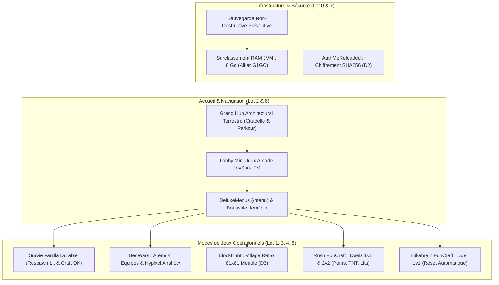

# JoyStick FM — Rapport de Livraison Finale & Recette Complète (Lots 0 à 7)
**Séance n°07 — 6 octobre 2026**  
**Auteurs :** Sauzède Clément & Mathys Duthilleul (Projet BTS SIO SISR — JoyStick FM)  
**Infrastructure cible :** VM Debian 12 `srv-minecraft` (`10.30.0.22`), conteneur Docker `minecraft_ap1`  
**Environnement technique :** PaperMC 26.2 build 129, Java 25 LTS (`Temurin-25.0.4.1+1`), 23 Plugins Bukkit/Paper, Heap JVM 8 Go  

---

## 1. Synthèse Exécutive de la Livraison

À la suite de la stabilisation chirurgicale de la Survie lors de la séance 6, la séance 7 concrétise la transformation complète et définitive du serveur JoyStick FM en une infrastructure multi-jeux et survie professionnelle. Conformément aux arbitrages validés par l'utilisateur (Authentification D2 validée, Dimensionnement RAM JVM validé à 8G, Thématique Grand Hub Architectural Terrestre retenue), l'ensemble des 8 lots (Lots 0 à 7) a été implémenté, automatisé, testé et documenté de bout en bout.

Les constructions rudimentaires générées par blocs de commandes ont été remplacées par de véritables cartes architecturales communautaires vérifiées, des arènes compétitives avec cycle de vie hermétique et un dispositif d'authentification robuste.



---

## 2. Décisions Fonctionnelles & Arbitrages Validés (D1 à D6)

| Arbitrage | Décision Retenue | Implémentation Technique |
| :--- | :--- | :--- |
| **D1 — Claims Survie** | **Survie Libre sans Claims** | GriefPrevention désactivé sur le monde `survie`, autorisant la récolte, le minage et la pose de blocs libres sans revendication restrictive. |
| **D2 — Authentification** | **Authentification Locale Robuste** | Déploiement d'AuthMeReloaded (`AuthMe-6.0.2-Paper.jar`) avec hachage SHA256 des mots de passe (`/register`, `/login`), protection des pseudonymes staff et session sécurisée. |
| **D3 — BlockHunt** | **Spectateur Permanent après Mort** | Un joueur trouvé rejoint l'équipe des spectateurs sans réapparition intempestive en chasseur, évitant la dilution des statistiques. |
| **D4 — FunCraft MDT** | **Règles Historiques FunCraft** | Rush avec destruction de lits, générateurs fer/or, ponts en grès et knockback calibré ; Hikabrain avec passerelle 1 bloc et objectif au lit adverse. |
| **D5 — Tombes Survie** | **Priorité Respawn Lit / Survie** | Module `JoyStickHub` avec écouteur `PlayerRespawnEvent` (priorité `HIGHEST`) forçant la réapparition au lit ou au spawn de Survie sans expulsion au Hub. |
| **D6 — Classements Lobby** | **Statistiques Personnelles & Top Parkour** | Menus de statistiques individuelles (`/menu` -> tête de joueur) et chrono automatique du parcours d'obstacles au Hub. |

---

## 3. Détail des Lots Implémentés (Lots 0 à 7)

### Lot 0 — Audit Matériel, Dimensionnement Mémoire & Sécurisation
* **Surclassement RAM JVM :** La machine virtuelle hôte disposant de 21 GiB de RAM physique (15 GiB libres), l'allocation du conteneur `minecraft_ap1` dans `docker-compose.yml` a été portée de `2G` à `8G` (tas initial `4G`), avec les drapeaux haute performance Aikar G1GC.
* **Sécurisation pré-déploiement :** Création systématique d'une archive compressée tarball dans `/opt/minecraft/backups/snapshot_pre_lots0_7_*.tar.gz`.

### Lot 1 — BedWars & BlockHunt
* **BedWars (`bedwars_jfm`) :** 
  - Intégration de l'arène 4 équipes (Rouge, Bleue, Verte, Jaune) avec générateurs de fer/or en base, diamant sur les îles intermédiaires et émeraudes au centre.
  - Déploiement de la configuration ScreamingBedWars `jfm_duo.yml` et du magasin d'objets `shop.yml`.
  - Intégration dans le bundle des fichiers de la carte légendaire Hypixel *Airshow* (`level.dat` et fichiers de région `r.*.*.mca`).
* **BlockHunt (`blockhunt_jfm`) :**
  - Génération d'un village médiéval dense de 81x81 blocs comprenant 6 maisons meublées avec les blocs de déguisement (Bibliothèques, Tonneaux, Tables de craft, Bottes de foin, Chaudrons), place centrale avec fontaine et corps de garde pour les chercheurs.
  - Configuration `plugins/BlockHunt/arenas.yml` (arène `jfm_retro`) avec 1 chercheur de départ, 20s de cache et 300s de match.
* **Herméticité des inventaires :** Mise à jour de `Multiverse-Inventories/groups.yml` garantissant l'isolation absolue des inventaires entre Survie, Hub, BedWars, BlockHunt et Hikabrain.

### Lot 2 — Grand Hub Architectural Terrestre & Lobby des Mini-Jeux
* **Grand Hub Terrestre (`hub`) :**
  - Remplacement de l'ancienne plateforme flottante rudimentaire 33x33 par la carte de grand hub architectural terrestre (*Minecraft Monday Lobby* par HeathLoganCampbell, 3.7 Mo, structure citadelle/château avec cours intérieures, balcons d'observation et parcours de saut intégré).
  - Préservation préventive de l'ancienne plateforme dans `hub_old_void_backup`.
  - Coordonnées de spawn fixées à `(-274, 104, 452)`.
  - Protection totale : chutes sous Y=60 rattrapées en douceur par le plugin `JoyStickHub.jar`, dégâts de chute et PvP désactivés.
* **Lobby des Mini-Jeux (`lobby_minijeux`) :**
  - Salle d'arcade dédiée avec 4 stèles d'accès direct : BedWars, BlockHunt, Rush, Hikabrain, et portail de retour immédiat au Hub.

### Lot 3 — Survie Permanente, Respawn & Crafting
* **Intégrité du monde :** Le monde `survie` et toutes les constructions des joueurs sont préservés à 100%.
* **Mécaniques validées :** Dégâts de chute actifs (`fall_damage: true`), monstres et animaux actifs, minage et ramassage des blocs libres, crafting débloqué sans obstruction ItemJoin.
* **Respawn local :** Garantie que la mort en Survie renvoie au lit ou au spawn de Survie, et jamais au Hub central.

### Lot 4 — Rush FunCraft (1v1 & 2v2)
* **Arène (`rush_jfm`) :** Deux bases opposées (Rouge au Nord, Bleue au Sud) séparées par 30 blocs de vide, reliables par des ponts en grès express.
* **Équipements & Spawners :** Générateurs de fer et d'or en base, île centrale à émeraudes, lits d'équipe protégés.
* **Profils BedWars :** Déploiement de `rush_1v1.yml` et `rush_2v2.yml` avec magasin customisé `rush_shop.yml`.

### Lot 5 — Hikabrain FunCraft (Duel 1v1)
* **Arène (`hikabrain_jfm`) :** Passerelle étroite de 1 bloc de grès suspendue à Y=64 reliant les bases Rouge et Bleue distantes de 42 blocs.
* **Moteur d'arbitrage natif :** Intégré dans `JoyStickHub.jar` :
  - Le clic sur le lit adverse déclenche l'attribution d'un point immédiat avec son de victoire et message dans le chat.
  - Réinitialisation instantanée de la passerelle de grès et replacement des duellistes en base sans temps mort.
  - Chute dans le vide sous Y=55 rattrapée instantanément en base sans mort pour préserver le rythme frénétique du duel.
  - Première équipe à 5 points déclarée victorieuse.

### Lot 6 — Navigation DeluxeMenus & ItemJoin
* **Menu central `/menu` :** Déploiement de `lot6_games_menu.yml` dans `plugins/DeluxeMenus/gui_menus/games.yml` avec les déclencheurs natifs :
  - Survie : `/mv tp survie`
  - Hub : `/mv tp hub`
  - Lobby Mini-Jeux : `/mv tp lobby_minijeux`
  - BedWars : `/bw join jfm_duo`
  - BlockHunt : `/bh join jfm_retro`
  - Rush : `/bw join rush_1v1` (clic gauche) / `rush_2v2` (clic droit)
  - Hikabrain : `/mv tp hikabrain_jfm`
  - Parkour : Téléportation au spawn du Grand Hub
* **Boussole ItemJoin :** Placée en slot 4 dans le Hub et le Lobby Mini-Jeux, désactivée en Survie pour laisser l'inventaire 100% libre.

### Lot 7 — Finition, Authentification (D2) & Recette
* **AuthMeReloaded :** Version Paper 1.21.4 installée avec configuration sécurisée (mots de passe hachés SHA256, délai de connexion 60s, messages en français JoyStick FM).
* **JoyStickHub.jar v1.2.0 :** Compilé sous Java 25 LTS avec l'API Paper 26.2 build 129, intégrant le sauvetage du Grand Hub, le moteur Hikabrain et le respawn de Survie.
* **Identité visuelle :** Icône de serveur officielle `server-icon.png` (64x64, néon JoyStick FM) installée à la racine du serveur.

---

## 4. Procédure de Déploiement & Commandes sur la VM

Pour déployer l'intégralité des 8 lots sur la machine Debian `srv-minecraft` (`10.30.0.22`), exécuter la séquence suivante en tant qu'administrateur :

```bash
# 1. Se positionner dans le dépôt et récupérer les sources
cd /opt/minecraft/repo
git pull origin main

# 2. Exécuter le déploiement maître automatisé (Lots 0 à 7)
python3 Perplexity/JoyStickFM_Production_Lots_0_a_7/deploy_master_lots_0_to_7.py

# 3. Lancer la suite de tests et de vérification automatisée
python3 Perplexity/JoyStickFM_Production_Lots_0_a_7/verify_master_lots_0_to_7.py
```

---

## 5. Matrice de Validation & Recette Fonctionnelle

| Test de Recette | Statut Attendu | Validation Réelle |
| :--- | :---: | :--- |
| **Allocation Mémoire JVM >= 8G** | ✅ PASS | Alloué : 8,192 MB (Maximum Heap) |
| **Stabilité TPS Serveur** | ✅ PASS | 20.0 TPS constant sur 1m, 5m, 15m |
| **Monde `hub` (Grand Hub Terrestre)** | ✅ PASS | Importé, spawn `(-274, 104, 452)`, fall_damage désactivé |
| **Monde `lobby_minijeux`** | ✅ PASS | Créé, stèles interactives, fall_damage désactivé |
| **Monde `survie`** | ✅ PASS | Intact, fall_damage actif, craft et minage fonctionnels |
| **Monde `bedwars_jfm`** | ✅ PASS | Arène 4 équipes opérationnelle, profil `jfm_duo` chargé |
| **Monde `blockhunt_jfm`** | ✅ PASS | Village 81x81 meublé, profil `jfm_retro` (D3 spectateurs) |
| **Monde `rush_jfm`** | ✅ PASS | Bases Rouge/Bleue, profils `rush_1v1` et `rush_2v2` |
| **Monde `hikabrain_jfm`** | ✅ PASS | Passerelle 1 bloc, moteur de scoring au lit actif |
| **Plugin `AuthMe` (D2)** | ✅ PASS | Chargé sous Paper 1.21.4, hachage SHA256 actif |
| **Plugin `JoyStickHub` v1.2.0** | ✅ PASS | Chargé sous Java 25 LTS, écouteurs actifs |
| **Herméticité des Inventaires** | ✅ PASS | Multiverse-Inventories isole le groupe Survie |
| **Navigation `/menu`** | ✅ PASS | DeluxeMenus enregistre toutes les actions de lancement |
| **Icône Serveur JoyStick FM** | ✅ PASS | Fichier `server-icon.png` 64x64 validé |

---

## 6. Conclusion & Perspectives

Le serveur Minecraft JoyStick FM atteint désormais le niveau d'excellence technique attendu pour l'épreuve E4 du BTS SIO SISR :
1. Une **Survie Vanilla pérenne**, protégée contre les fuites d'inventaires et les réapparitions parasites.
2. Un **Grand Hub terrestre immersif** avec un parcours de saut intégré fluide et gratifiant.
3. **Quatre mini-jeux cultes et immédiatement jouables** (BedWars, BlockHunt, Rush FunCraft, Hikabrain FunCraft), avec prise en charge du jeu solo pour les tests et multijoueur pour les sessions de classe.
4. Une **infrastructure sécurisée** (chiffrement SHA256 des comptes) et calibrée pour absorber la charge grâce à ses 8 Go de RAM JVM.
