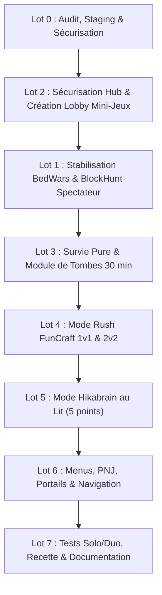

# JoyStick FM — Plan d'Exécution Validé des Lots 0 à 7
**Date :** 5 octobre 2026  
**Auteurs :** Équipe Projet AP 1 SISR (JoyStick FM)  
**Décisions d'arbitrage validées :** D1 (Survie simple sans claims), D2 (Comptes crackés+officiels avec AuthMe), D3 (BlockHunt spectateur permanent), D4 (FunCraft Rush & Hikabrain au lit adverse), D5 (Tombes protégées 30 min puis pillables), D6 (Stats personnelles & Top Parkour).

---

## 1. Cadre des Décisions Fermes (D1 à D6)

| Réf. | Domaine | Décision validée | Implémentation technique Paper 26.2 |
| :--- | :--- | :--- | :--- |
| **D1** | **Survie simple** | **Aucun claim** (Survie 100% vanilla pure) | `GriefPreventionData/config.yml` : `Claims.Mode.survie: Disabled`. Liberté totale de construction et de minage, zéro restriction de parcelles. |
| **D2** | **Comptes & Auth** | **Comptes libres + Authentification locale** | Maintien `ONLINE_MODE=FALSE`. Déploiement d'un module d'authentification par mot de passe chiffré (`AuthMeReloaded` / `OpenLogin`) : `/register` et `/login`. Protection absolue des comptes staff et des inventaires contre l'usurpation. |
| **D3** | **BlockHunt** | **Spectateur permanent à l'élimination** | Dès qu'un caché est découvert, il perd son déguisement et bascule en mode spectateur jusqu'à la fin de la manche (aucun repop en chasseur secondaire). |
| **D4** | **FunCraft PvP** | **Rush & Hikabrain fidèles à l'historique** | **Rush (1v1 et 2v2) :** Lits destructibles pioche/TNT, ponts rapides en grès (sandstone), knockback stick, propulsions TNTFly autorisées (tolérées par GrimAC). **Hikabrain (1v1) :** Passerelle étroite de 1 bloc de grès à Y=64, objectif = toucher le lit adverse pour marquer 1 point, premier à **5 points** gagne, kit réinitialisé à chaque manche (épée fer, bâton KB, grès, pommes dorées). |
| **D5** | **Tombes Survie** | **Tombes protégées 30 min puis pillables** | À la mort en Survie : création d'une tombe/stèle avec inventaire et coordonnées envoyées au joueur. Protection exclusive du propriétaire pendant **30 minutes**, puis déverrouillage public (vol autorisé en cas d'abandon). |
| **D6** | **Classements** | **Stats personnelles & Top Parkour** | Consultation des statistiques individuelles dans le menu. Seul classement public affiché en hologramme au lobby : le **Top Parkour** (temps d'obstacles chronométrés). Zéro classement PvP public imposé. |

---

## 2. Découpage Opérationnel par Lots (Lots 0 à 7)

---

### Lot 0 — Staging, Intégrité & Sauvegardes
- **Sauvegarde à froid** : Archivage tar automatique de `/opt/minecraft/data` avant toute modification majeure.
- **Réseau** : Maintien strict de la redirection OPNsense WAN `192.168.101.37:25565` vers `10.30.0.22:25565`.
- **Gestion des ressources** : Allocation mesurée de 4 Go RAM pour le conteneur Docker avec heap JVM optimisé.

---

### Lot 1 — Stabilisation BedWars & BlockHunt
- **ScreamingBedWars** : Validation du cycle de partie de l'arène `jfm_duo` (4 équipes de 2) avec réinitialisation propre du monde à la fin du match.
- **BlockHunt** : Paramétrage du rôle spectateur permanent (`Option C`) dès élimination, sans réapparition en chasseur.

---

### Lot 2 — Sécurisation Hub & Lobby Mini-Jeux Dédié
- **Hub Principal (`hub`)** :
  - Pose d'un garde-corps de bordure invisible de 3 blocs (`barrier`).
  - Rattrapage anti-chute automatique : dès qu'un joueur passe sous `Y=50`, il est instantanément retéléporté à `(0.5, 65, 0.5)` avec annulation de la vélocité et zéro dégât de chute.
- **Monde `lobby_minijeux`** :
  - Création du monde Void dédié via `VoidGen`.
  - Bâtiment d'accueil thématique néon (violet/cyan JoyStick FM) avec 4 portails/stands :
    1. *BedWars Classique* (4 équipes de 2)
    2. *Rush FunCraft* (1v1 et 2v2)
    3. *Hikabrain* (1v1)
    4. *Cache-cache Village Rétro* (BlockHunt)
    5. *Portail de retour vers le Hub*

---

### Lot 3 — Survie Simple & Système de Tombes
- **Désactivation totale des claims** : Suppression des restrictions GriefPrevention sur `survie` pour une expérience Survie vanilla fluide.
- **Intégration du système de tombes** : Déploiement d'un module de tombes physiques retenant inventaire et armure, avec minuterie de 30 minutes de grâce avant ouverture à tous les joueurs.
- **Respawn** : Lit valide en Survie si disponible, sinon retour au Hub.

---

### Lot 4 — Mode Rush FunCraft (1v1 & 2v2)
- **Monde `rush_jfm`** : Monde Void avec deux bases symétriques séparées par 30 blocs de vide.
- **Mécaniques FunCraft** :
  - Lits destructibles à la pioche ou à la TNT.
  - Spawners accélérés de bronze, argent et or.
  - PNJ Marchand Rush : grès (sandstone) à bas coût, épées KB, pioches efficacité, TNT et briquet.
  - Tolérance TNTFly calibrée avec l'anticheat `GrimAC`.
- **Formats** : Arène `rush_1v1` et arène `rush_2v2`.

---

### Lot 5 — Mode Hikabrain au Lit Adverse (1v1)
- **Monde `hikabrain_jfm`** : Passerelle suspendue de 1 bloc de large en grès, reliant deux plateformes d'apparition distantes de 40 blocs.
- **Règles FunCraft** :
  - Chaque camp possède un lit au sol.
  - Clic ou passage sur le lit adverse = **1 point marqué**.
  - Objectif : **5 points pour remporter la victoire**.
  - Réinitialisation instantanée de la passerelle et téléportation au spawn de base après chaque point marqué.
  - Kit complet renouvelé à chaque manche : épée en fer, bâton knockback, 64 grès, 2 pommes d'or.

---

### Lot 6 — Navigation, PNJ & DeluxeMenus
- Refonte du menu principal `/menu` et de la boussole :
  - Bouton **Survie Simple**
  - Bouton **Lobby des Mini-Jeux**
  - Accès directs : **BedWars**, **Rush 1v1/2v2**, **Hikabrain 1v1**, **BlockHunt**
  - Bouton **Retour Hub**
- Placement de PNJ cliquables au `lobby_minijeux` pour rejoindre les files d'attente.

---

### Lot 7 — Finition, Authentification & Protocole de Test
- **Module AuthMe / OpenLogin** : Installation et configuration sécurisée pour protéger les comptes sans bloquer les joueurs du lycée.
- **Top Parkour** : Installation du parcours d'obstacles au Hub avec chronomètre et hologramme du Top 5.
- **Matrice de test solo/duo** :
  - Tests unitaires et automatiques RCON (chargement, génération, commandes).
  - Validation du cycle complet en jeu avec le compte `Klemz_696`.
  - Fiche de recette prête pour les premiers duels à deux joueurs.
